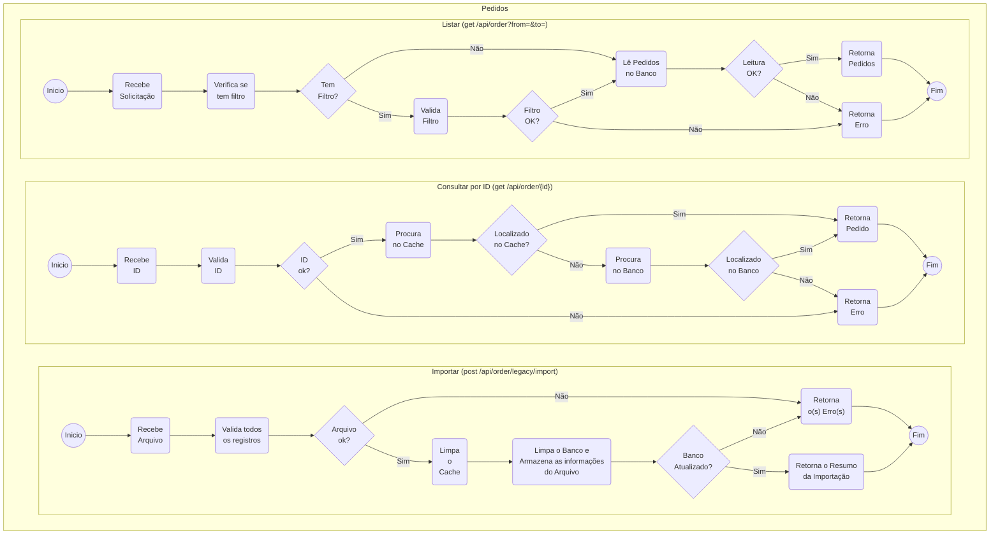

```mermaid
graph 
    subgraph Pedidos
        subgraph "Importar (post /api/order/legacy/import)"
            direction LR
            A1((Inicio)) --> B1(Recebe \nArquivo)
            B1 --> C1(Valida todos \nos registros)
            C1 --> D1{Arquivo\n ok?}
            D1 --> |Sim| E1(Limpa \no\n Cache)
            E1 --> F1(Limpa o Banco e\n Armazena as informações\n do Arquivo)
            F1 --> G1{Banco \nAtualizado?}
            G1 --> |Sim| H1(Retorna o Resumo\n da Importação)
            D1 --> |Não| Y1("Retorna \no(s) Erro(s)")
            G1 --> |Não| Y1
            Y1 --> Z1
            H1 --> Z1((Fim))
        end
        subgraph "Consultar por ID (get /api/order/{id})"
            direction LR
            A2((Inicio)) --> B2(Recebe\n ID)
            B2 --> C2(Valida\n ID)
            C2 --> D2{ID\n ok?}
            D2 --> |Sim| E2(Procura \nno Cache)
            E2 --> F2{Localizado\n no Cache?}
            F2 --> |Sim| G2(Retorna \nPedido)
            F2 --> |Não| H2(Procura\n no Banco)
            H2 --> I2{Localizado\n no Banco}
            I2 --> |Sim| G2
            D2 --> |Não| Y2("Retorna\n Erro")
            Y2 --> Z2
            I2 --> |Não| Y2
            G2 --> Z2((Fim))
        end
        subgraph "Listar (get /api/order?from=&to=)"
            direction LR
            A3((Inicio)) --> B3(Recebe \nSolicitação)
            B3 --> C3(Verifica se\n tem filtro)
            C3 --> D3{Tem \nFiltro?}
            D3 --> |Não| E3(Lê Pedidos\n no Banco)
            E3 --> F3{Leitura\n OK?}
            F3 --> |Sim| G3(Retorna \nPedidos)
            D3 --> |Sim| H3(Valida \nFiltro)
            H3 --> I3{Filtro\n OK?}
            I3 --> |Sim| E3
            I3 --> |Não| Y3("Retorna\n Erro")
            F3 --> |Não| Y3
            Y3 --> Z3
            G3 --> Z3((Fim))
        end
    end
```